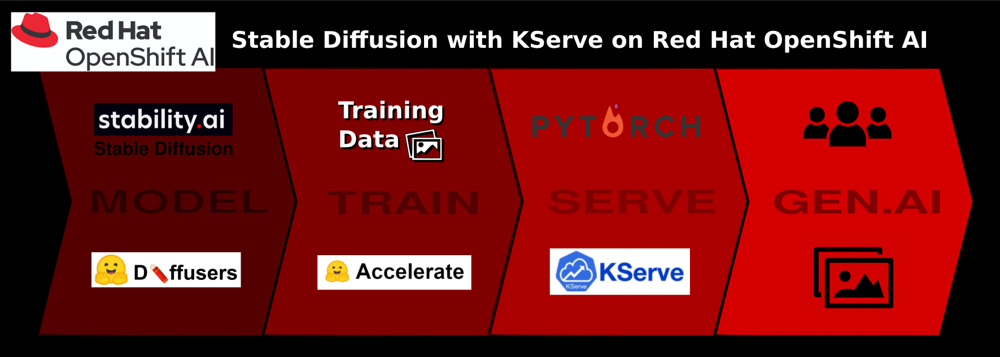
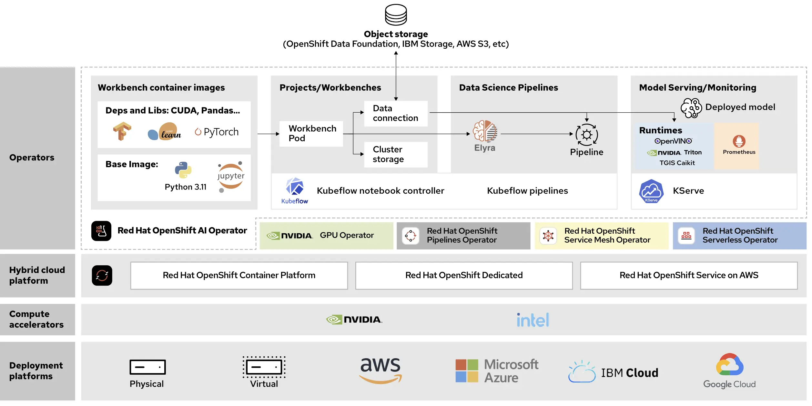
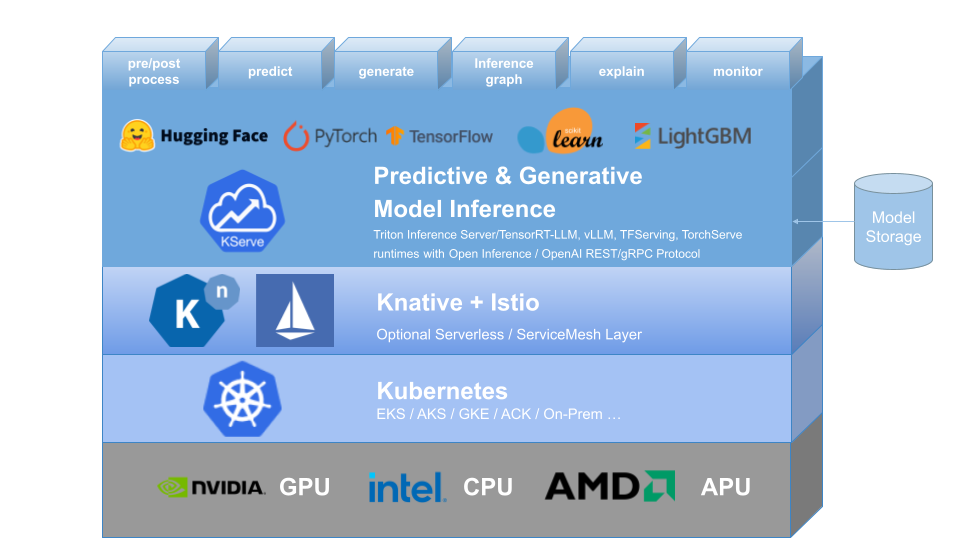

<p align="center">
  
</p>

# Project Purpose

Proof-of-concept scenarios using [Red Hat OpenShift AI](https://www.redhat.com/en/technologies/cloud-computing/openshift/openshift-ai) 
to serve variations of the Stable Diffusion text-to-image model. An exercise undertaken as reason to go hands-on with model serving via [KServe](https://kserve.github.io/website/latest/) 
& [TorchServe](https://pytorch.org/serve/) in order to get a better understanding of their makeup, function & configuration aside Red Hat OpenShift AI.

It's been fairly trivial to find notebooks in the wild showcasing HuggingFace [diffusers](https://github.com/huggingface/diffusers) pipelines 
which handle model load through to image generation, however, there are fewer examples that I've found showcasing an "Ensemble (or Mixture) 
of Experts" type model pipeline served with trained weights, in particular via [KServe](https://kserve.github.io/website/latest/) 
& [Red Hat OpenShift AI](https://www.redhat.com/en/technologies/cloud-computing/openshift/openshift-ai).

> <sub>Project done for educational purposes. Content herein not intended for production use.</sub>

# Exploratory Research

This repo includes several directories which each represent a scenario I assembled for understanding the various aspects of model serving with some common toolings alongside OpenShift AI.

## Diffusers Pipelines via Jupyter Notebook

- The [stable-diffusion-pipelines](stable-diffusion-pipelines) directory showcases a simplistic approach using a few lines of code inside a notebook to load the Stable Diffusion model and
generate an image from text prompt. If you're simply interested in seeing Stable Diffusion at work, this will cover it.

## Stable Diffusion 2 Base Model via KServe/TorchServe

- The [stable-diffusion-2](stable-diffusion-2) directory introduces model serving to the mix. If you want to be able to make some sense of what 
goes on with the next few scenarios below, you'll want to make a stop through here. Partly from desire to learn a few items common to the 
problem space and partly from being the first solution I crossed for working with a pipeline-type model with multiple components (ok, mostly the latter), I 
decided to bundle the Stable Diffusion model as `.mar` archive to be served with TorchServe via KServe. The scenario includes all the files and 
notebooks needed for downloading the SD2 model, creating the model archive, setting up the model in OpenShift AI & hitting the inference endpoint. 

## Stable Diffusion XL Packaged Base Model & Refiner via KServe/TorchServe

- The previous example focused on pulling a 'lighter' version of Stable Diffusion (SD2) & setting up model serving just to see & understand the flow of things 
while minimalizing time lost between iterations as best I could (generating, downloading, uploading, and loading 11GB archives isn't speedy). With that patten established, 
I turned my attention to figuring out how to get things working with larger, more resource-intensive setups, such as using Stable Diffusion 
XL base & refiner models together. The [stable-diffusion-xlr](stable-diffusion-xlr) directory supplies archival & query notebooks, similarly as to 
before, as well as the custom handler class needed for the scenario.

## Stable Diffusion XL with Weights via KServe/TorchServe

- After walking through the previous exercises to understand SD model serving on OpenShift AI with TorchServe & KServe, then walking towards 
the most modern, capable version of the model, I next wanted to understand the more likely scenario wherein a user wishes to tune their model using
their own images to better accommodate a specific line of queries. The [stable-diffusion-xl-train](stable-diffusion-xl-train) directory includes
notebooks & images for such training, the model archival, & querying the inference endpoint similarly to previous scenarios.

## Stable Diffusion 3

### :warning: SD3 directory is WIP! Loading & querying in archive notebook works fine. Expect issues w/ tokenized model access for container &/or training SIGKILLS.

- If you're after a look at the latest & greatest that StabilityAI has made available, the [stable-diffusion-3](stable-diffusion-3) directory offers notebooks
for emulating previous examples for serving the base SD3 model or just using the diffusers pipeline with provided tuning weights. The `handler` class for 
tuned weights serving has been included, but as before, will require updates should you alter the pipeline. If you decide to try and serve the base model, 
know what you're in for - the `.mar` archive file is 12GB.


## A Cleaner Containerized Approach for Stable Diffusion via KServe

- If you're interested in seeing a scenario similar to the XL-refiner scenario above, but without the added noise of figuring TorchServe & model 
archives, I have a recommendation. For a neatly-defined, containerized solution that offers Stable Diffusion XL base model with optional refiner 
via v1 KServe Inference Protocol, have a look at the [igm-on-openshift](https://github.com/rh-aiservices-bu/igm-on-openshift/tree/main/sdxl) 
repository put together by fellow Red Hatter Guillaume Moutier.

## A More Performant, Distributed Approach via OpenShift AI with Ray

- If you're less interested in the investigative side of things, but instead seek a more robust, performant setup, then I'd recommend taking a look
at the Stable Diffusion [distributed workload example](https://github.com/opendatahub-io/distributed-workloads/tree/main/examples/stable-diffusion-dreambooth) which 
showcases fine-tuning Stable Diffusion with Ray and DreamBooth on OpenShift AI. This will introduce some complexity around Ray clustering and shared file
storage (Open Data Foundation), however, if you want a look at something closer approximating proper scalability, this is a good scenario to follow.

# Research Cluster Specifications

> - OpenShift version `4.14.35`
> - OpenShift AI version `2.13.0`
> - Node Feature Discovery Operator `4.14.0` (enable GPU accelerators)
> - NVIDIA GPU Operator `24.6.2` (enable GPU accelerators)
> - Single-model serving cluster configuration
> - Cluster backed by [Red Hat OpenShift Dedicated](https://www.redhat.com/en/technologies/cloud-computing/openshift/dedicated)
> - S3 Bucket utilized for model storage, though Minio can easily do the same
> - Additional worker Machine Pool added consisting of 2x EC2 `g5.8xlarge` [instances](https://aws.amazon.com/ec2/instance-types/g5/)

# Red Hat OpenShift AI

The AI/ML Platform in use.

> Red Hat OpenShift AI is an artificial intelligence (AI) platform that provides tools to rapidly develop, train, serve, and monitor machine learning
models on-site, in the public cloud, or at the edge. It's a flexible, scalable artificial intelligence (AI) and machine learning (ML) platform that
enables enterprises to create and deliver AI-enabled applications at scale across hybrid cloud environments.
>
> Red Hat OpenShift AI helps you build out an enterprise grade AI and MLOps platform to create and deliver GenAI and predictive models by providing supported AI tooling on top of OpenShift. It’s based on Red Hat OpenShift, a container based application platform that efficiently scales to handle workload demands of AI operations and models. You can run your AI workloads across the hybrid cloud, including edge and disconnected environments.
>
> Additionally, Red Hat actively partners with leading AI vendors, such as Anaconda, Intel, IBM, and NVIDIA to make their tools available for data scientists as OpenShift AI components. You can optionally activate these components to expand the OpenShift AI capabilities. Depending on the component that you want to activate, you might need to install an operator, use the Red Hat Ecosystem, or add a workbench image.

The following figure depicts the general architecture of a OpenShift AI deployment, including the most important concepts and components:

<p align="center">
  
</p>

<sup>[source](https://developers.redhat.com/articles/2024/08/06/red-hat-openshift-ai-and-machine-learning-operations)</sup>

## Data Science Cluster (OpenShift AI CRD) `spec`:
```yaml
spec:
  components:
    codeflare:
      managementState: Managed
    kserve:
      managementState: Managed
      serving:
        ingressGateway:
          certificate:
            type: SelfSigned
        managementState: Managed
        name: knative-serving
    trustyai:
      managementState: Removed
    ray:
      managementState: Managed
    kueue:
      managementState: Managed
    workbenches:
      managementState: Managed
    dashboard:
      managementState: Managed
    modelmeshserving:
      managementState: Managed
    datasciencepipelines:
      managementState: Managed
    trainingoperator:
      managementState: Removed
```

# KServe

The model-serving mechanism in use.

> - KServe is a standard, cloud agnostic Model Inference Platform for serving predictive and generative AI models on Kubernetes, built for highly scalable use cases.
>
>- Provides performant, standardized inference protocol across ML frameworks including OpenAI specification for generative models.
>
>- Support modern serverless inference workload with request based autoscaling including scale-to-zero on CPU and GPU.
>
>- Provides high scalability, density packing and intelligent routing using ModelMesh.
>
>- Simple and pluggable production serving for inference, pre/post processing, monitoring and explainability.
   >  Advanced deployments for canary rollout, pipeline, ensembles with InferenceGraph.
<p align="center">
  
</p>

<sup>[source](https://github.com/kserve/kserve)</sup>

## PyTorch TorchServe & `torchserve-kfs`

The serving runtime in use.

>PyTorch is an open-source machine learning framework, originally created by Facebook, that has become popular among ML researchers and data 
scientists for its ease of use and “Pythonic” interface. However, deploying and managing models in production is often the most difficult part 
of the machine learning process requiring customers to write prediction APIs and scale them.
>
>TorchServe makes it easy to deploy PyTorch models at scale in production environments. It delivers lightweight serving with low latency, so you can deploy your models for 
high performance inference. It provides default handlers for the most common applications such as object detection and text classification, 
so you don’t have to write custom code to deploy your models. With powerful TorchServe features including multi-model serving, model versioning 
for A/B testing, metrics for monitoring, and RESTful endpoints for application integration, you can take your models from research to 
production quickly.

<sup>[source](https://aws.amazon.com/about-aws/whats-new/2020/04/introducing-torchserve/)</sup>

# Stable Diffusion

The model in use. 

The [Stable Diffusion](https://en.wikipedia.org/wiki/Stable_Diffusion) models from [Stability AI](https://stability.ai/stable-image) 
 are deep-learning, text-to-image generative models originating from [CompVis](https://github.com/compvis)'s [latent diffusion](https://github.com/CompVis/latent-diffusion)
project out of Germany. Though often loosely referred to as a "model", Stable Diffusion is more an "ensemble of experts" model pipeline composed of various models that, when combined, 
achieve the target goal. The number and nature of the individual models making up the composite vary from release to release

>The LDM is trained by using a Markov chain to gradually add noise to the training images. The model is then trained to reverse this process, starting 
with a noisy image and gradually removing the noise until it recovers the original image. More specifically, the training process can be 
described as follows:
>
>    - Forward diffusion process: Given a real image X<sub>0</sub>, a sequence of latent variables X<sub>1:T</sub> 
>    are generated by gradually adding Gaussian noise to the image, according to a pre-determined "noise schedule".
>    
>    - Reverse diffusion process: Starting from a Gaussian noise sample X<sub>T</sub>, the model learns to predict the noise added 
>    at each step, in order to reverse the diffusion process and obtain a reconstruction of the original image X<sub>0</sub>.
>
>The model is trained to minimize the difference between the predicted noise and the actual noise added at each step. This is typically done 
>using a mean squared error (MSE) loss function.
>
>Once the model is trained, it can be used to generate new images by simply running the reverse diffusion process starting from a random 
>noise sample. The model gradually removes the noise from the sample, guided by the learned noise distribution, until it generates a final image. 

<sup>[source](https://en.wikipedia.org/wiki/Latent_diffusion_model)</sup>

## Model Components

There are multiple versions of Stable Diffusion currently available, including `1.0`, `2.0`, `XL`, `TurboXL`, & `3.0`. Each version comes from building
on experience of previous iterations and thus components & methods can vary between them. Generally, the makeup of the Stable Diffusion model pipeline (see model
[repository](https://huggingface.co/stabilityai/stable-diffusion-xl-base-1.0/tree/main)), is as follows:

```
- Example: Stable Diffusion XL Base 1.0
├── scheduler/
├── text_encoder/
├── text_encoder_2/
├── tokenizer/
├── tokenizer_2/
├── unet/
├── vae/
├── vae_1_0/
├── vae_decoder/
├── vae_encoder/
├── model_index.json
```

The following sections break down the purpose & general methodology for the various components.

### Variational AutoEncoder (VAE)

> To compress the image data, a variational autoencoder (VAE) is first trained on a dataset of images. The encoder part of the VAE takes an image as 
input and outputs a lower-dimensional latent representation of the image. This latent representation is then used as input to the U-Net. Once the 
model is trained, the encoder is used to encode images into latent representations, and the decoder is used to decode latent representations back 
into images.
>
>The decoder part of the VAE transforms the latent representation back into an image. Denoised latents generated by the reverse diffusion process 
are converted into final images using the VAE decoder.

<sup>[source](https://en.wikipedia.org/wiki/Latent_diffusion_model)</sup>

### U-Net Convolutional Neural Network (UNet)

> The U-Net predicts denoised image representation of noisy latents. Here, noisy latents act as input to Unet and the output of UNet is noise in the latents. 
Using this, we are able to get actual latents by subtracting the noise from the noisy latents.
>
>The Unet that takes in the noisy latents (x) and predicts the noise. We use a conditional model that also takes in the timestep (t) and our 
text embedding as guidance.

<sup>[source](https://medium.com/@onkarmishra/stable-diffusion-explained-1f101284484d)</sup>

### Text Encoder

Responsible for transforming the provided input prompt into an embedding space that serves as input for the U-Net neural network. Acts as a guidance
for noisy latents when we train U-Net for denoising purposes. Responsible for conversion of input to collections of characters (tokens) which have semantic
meaning for a model.

Stable Diffusion uses a pretrained Text Encoder known as [CLIP](https://huggingface.co/docs/transformers/en/model_doc/clip).

### Scheduler

Works in tandem with U-Net; dictates the denoising process while balancing quality of image with speed of inference.

### Pipeline Model Index
Content of the `model_index.json` is somewhat indicative of the pipeline makeup:
```json
{
  "_class_name": "StableDiffusionXLPipeline",
  "_diffusers_version": "0.19.0.dev0",
  "force_zeros_for_empty_prompt": true,
  "add_watermarker": null,
  "scheduler": [
    "diffusers",
    "EulerDiscreteScheduler"
  ],
  "text_encoder": [
    "transformers",
    "CLIPTextModel"
  ],
  "text_encoder_2": [
    "transformers",
    "CLIPTextModelWithProjection"
  ],
  "tokenizer": [
    "transformers",
    "CLIPTokenizer"
  ],
  "tokenizer_2": [
    "transformers",
    "CLIPTokenizer"
  ],
  "unet": [
    "diffusers",
    "UNet2DConditionModel"
  ],
  "vae": [
    "diffusers",
    "AutoencoderKL"
  ]
}
```
