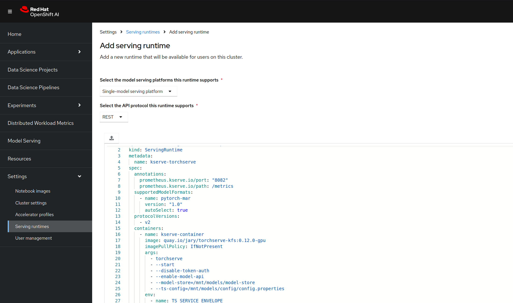

# Serving the Stable Diffusion 2 Model & Querying via Inference Endpoint

Example images generated using this scenario:


## Dockerfile

(_Optional step_) Begin by building & pushing your ServingRuntime container image to an accessible image repository.

The ServingRuntime image I've used builds slightly on the available image. When using the upstream [KServe TorchServe](https://github.com/idiap/pytorch-serve/blob/master/kubernetes/kserve/README.md) image, I encountered 
permissions issues deploying on OCP due to [securityContextConstraints](https://docs.openshift.com/container-platform/4.17/authentication/managing-security-context-constraints.html). The torchserve 
image, and thus the kfs image we're deriving from, assume the `model-server` user for execution. The following Dockerfile was used to allow the 
OCP-assigned user access to a few essential directories without elevating out of `restricted-v2` SCC.

```dockerfile
FROM pytorch/torchserve-kfs-nightly:latest-gpu

USER root

RUN mkdir /.cache && \
    chgrp -R 0 /home/model-server /.cache && \
    chmod -R g=u /home/model-server /.cache

USER model-server
```

Again, this is _optional_, feel free to use the image already provided in ServingRuntime YAML below. Otherwise, build & push your image:
```commandline
docker build -t quay.io/jary/torchserve-kfs:0.12.0-gpu . && docker push quay.io/jary/torchserve-kfs:0.12.0-gpu
```

## ServingRuntime

To set up the TorchServe ServingRuntime based on the above Dockerfile within OpenShift AI, access `Settings` > `Serving runtimes` > `Add serving runtime` > 
`Start from scratch` and supply the YAML below.

### Example model entry via OpenShift AI GUI:


### ServingRuntime YAML
```yaml
apiVersion: serving.kserve.io/v1alpha1
kind: ServingRuntime
metadata:
  name: kserve-torchserve
spec:
  annotations:
    prometheus.kserve.io/port: "8082"
    prometheus.kserve.io/path: /metrics
  supportedModelFormats:
    - name: pytorch-mar
      version: "1.0"
      autoSelect: true
  protocolVersions:
    - v2
  containers:
    - name: kserve-container
      image: quay.io/jary/torchserve-kfs:0.12.0-gpu
      imagePullPolicy: IfNotPresent
      args:
        - torchserve
        - --start
        - --disable-token-auth
        - --enable-model-api
        - --model-store=/mnt/models/model-store
        - --ts-config=/mnt/models/config/config.properties
      env:
        - name: TS_SERVICE_ENVELOPE
          value: "{{.Labels.serviceEnvelope}}"
        - name: PROTOCOL_VERSION # specify we want to use v2 Inference Protocol
          value: v2
        - name: MODEL_LOAD_MAX_TRY # optional, default 10
          value: "20"
        - name: MODEL_LOAD_DELAY # optional, default 30
          value: "45"
        - name: MODEL_LOAD_TIMEOUT # optional, default 5
          value: "10"
      securityContext:
        runAsUser: 1001130001
      resources:
        requests:
          cpu: "1"
          memory: 2Gi
        limits:
          cpu: "1"
          memory: 2Gi
```

## Handler Configuration

When working with Serving Runtimes and KServe, note that an additional layer of data transformation is sometimes required so that the user interacts with inference endpoints
in accordance with the KServe Inference Protocol version of choice. The python `handler` file which has been added to the `.mar` archive is responsible for translating between payloads 
expected for and provided by KServe and those expected for and provided by the underlying inference service. The handler provided here only deals with the `v2` protocol via `REST`. The following sections are
important to understand.

Note that if you were interested in expanding supported protocols to include the `v1` API or GRPC versions, the handler would need to accommodate those call types. 
Likewise, support for batch calls would also necessitate handler changes. Follow the base class for further info.

### initialize

In `initialize`, we unpack the supplied `.mar` archive file and use this to seed the HuggingFace diffusers [pipeline](https://huggingface.co/docs/diffusers/en/api/pipelines/stable_diffusion/overview). Specifically here, the [DiffusionPipeline](https://huggingface.co/docs/diffusers/main/en/api/pipelines/overview#diffusers.DiffusionPipeline).
The pipeline class in use will be dependent on the model version in use (e.g. StableDiffusionXLPipeline vs. StableDiffusionPipeline):
```python
with zipfile.ZipFile(model_dir + "/model.zip", "r") as zip_ref:
    zip_ref.extractall(model_dir + "/model")

self.pipe = DiffusionPipeline.from_pretrained(model_dir + "/model")
self.pipe.to(self.device)
logger.info("Diffusion model from path %s loaded successfully", model_dir)

self.initialized = True
```

### preprocess

In `preprocess` we deal with extracting our photo text prompt from the payload which should align with the v2 Inference Protocol's [Request JSON Object](https://kserve.github.io/website/0.8/modelserving/inference_api/#inference-request-json-object).
```python
for _, data in enumerate(requests):
    input_text = data['body']['inputs'][0]['data'][0]
    if input_text is None:
        input_text = data.get("body")
    if isinstance(input_text, (bytes, bytearray)):
        input_text = input_text.decode("utf-8")
    logger.info("Received text: '%s'", input_text)
    inputs.append(input_text)
```
### inference
In `inference`, the initialized pipeline is used to query the model with inputs extracted during `preprocess`.
```python
inferences = self.pipe(
    inputs, guidance_scale=7.5, num_inference_steps=50, height=768, width=768
).images
```

### postprocess
In `postprocess`, we now take the data for the image provided by the model and format it to follow the v2 Inference Protocol's [Response JSON Object](https://kserve.github.io/website/0.8/modelserving/inference_api/#inference-response-json-object):
```python
img_nparray = np.array(inference_output[0])
response = {
    "id": "42",
    "outputs": [
        {
            "name": "output0",
            "datatype": "fp16",
            "shape": img_nparray.shape,
            "data": img_nparray.tolist()
        }
    ]
}
return [orjson.dumps(response)]
```
While I've chosen to use NumPy arrays to represent the image data in this example, note it's also possible to pass around Tensor information instead. When doing so, make sure whatever 
client you're using to query with is expecting that same format in their resulting payload.
```python
for image in inference_output:
    tensored_pil = TF.pil_to_tensor(image)
    flattened_tensor = tensored_pil.flatten()
    images.append(flattened_tensor.tolist())
```

## Model Download & Archiving

In the name of limiting variables, I first tackled this scenario using just the base Stable Diffusion 2 model with no additional training. Model download & 
conversion to `.mar` (Model ARchive) format was performed using the `dl-and-archive-sd2.ipynb` notebook. 

Open & execute the full notebook. The two most noteworthy sections of the notebook include the use of HuggingFace diffusers pipelines for fetching the model & saving locally:
```python
import torch
from diffusers import DiffusionPipeline

pipeline = DiffusionPipeline.from_pretrained(
    "stabilityai/stable-diffusion-2",
    variant="fp16",
    torch_dtype=torch.float16,
)
pipeline.save_pretrained("./downloaded_model")
```

And the archival of the downloaded model, which supplies the handler class & requirements file:
```python
!torch-model-archiver --model-name stable-diffusion \
    --version 1.0 \
    --handler stable_diffusion_handler.py \
    --extra-files model.zip \
    --requirements-file ./requirements.txt \
    --force #replace if already exists
```
After the notebook executes, the directory should contain the `stable-diffusion.mar` file that you now want to download in order to add to your bucket (see below). 
When working with Stable Diffusion 2 file sizes aren't terribly big by today's standards. You can expect a few gigs here.

## Bucket Config & Content

### config.properties

Use the following for your `[bucket-name]/config/config.properties` file (also found in current directory):
```properties
inference_address=http://0.0.0.0:8085
management_address=http://0.0.0.0:8085
metrics_address=http://0.0.0.0:8082
grpc_inference_port=7070
grpc_management_port=7071
enable_envvars_config=true
install_py_dep_per_model=true
enable_metrics_api=true
metrics_mode=prometheus
NUM_WORKERS=1
number_of_netty_threads=4
job_queue_size=10
max_response_size=30000000
model_store=/mnt/models/model-store
model_snapshot={"name":"startup.cfg","modelCount":1,"models":{"stable-diffusion":{"1.0":{"defaultVersion":true,"marName":"stable-diffusion.mar","minWorkers":1,"maxWorkers":5,"batchSize":1,"maxBatchDelay":5000,"responseTimeout":300}}}}
```

### S3 Bucket layout

Upload to Minio/S3 Bucket using the following subdirectory structure:

```
bucket
├── stable-diffusion/              # name here is not too important
│   ├── config/
│   │   ├── config.properties      # copied from this workbook / directory
│   ├── model-store/
│   |   ├── stable-diffusion.mar   # filename is important! copy file from this workbook directory after completing previous/last step
```

### S3 example


## Model Deployment

### Data Connection

Set up your data connection for using S3 or Minio as seen here (using your region/key info):


### Model Location

When using the above bucket layout & data connection config, the model location when deploying will look like this:


### Model Deployment via GUI

With everything in place, time to deploy the model via Inference Service:


## Model Server Pod Startup

Upon initial deployment, the pod (named something akin to `kt2-predictor-00001-deployment-7447db456d-547l6`) will first copy the 
content of your configured bucket to local storage:


Once copied, the container image that we've built or supplied for `kserve-container` is downloaded (if not already present), which can take some time.
The next output of interest made available should appear in the `kserve-container` logs after the image fetch completes. Note that our config.properties 
is reflected in logs as it is located and loaded. 

Towards the bottom, note the `root` thread that is now showing that it's within a loading iteration 
and currently on `..1 of 20 tries..`:

```text
2024-10-15T18:43:19,616 [DEBUG] main org.pytorch.serve.util.ConfigManager - xpu-smi not available or failed: Cannot run program "xpu-smi": error=2, No such file or directory
2024-10-15T18:43:19,620 [WARN ] main org.pytorch.serve.util.ConfigManager - Your torchserve instance can access any URL to load models. When deploying to production, make sure to limit the set of allowed_urls in config.properties
2024-10-15T18:43:19,674 [INFO ] main org.pytorch.serve.servingsdk.impl.PluginsManager - Initializing plugins manager...
2024-10-15T18:43:19,803 [INFO ] main org.pytorch.serve.metrics.configuration.MetricConfiguration - Successfully loaded metrics configuration from /home/venv/lib/python3.9/site-packages/ts/configs/metrics.yaml
2024-10-15T18:43:19,867 [INFO ] main org.pytorch.serve.ModelServer -
Torchserve version: 0.12.0
...
2024-10-15T18:43:19,874 [INFO ] main org.pytorch.serve.servingsdk.impl.PluginsManager - Loading snapshot serializer plugin...
2024-10-15T18:43:19,891 [INFO ] main org.pytorch.serve.snapshot.SnapshotManager - Started restoring models from snapshot {"name":"startup.cfg","modelCount":1,"models":{"stable-diffusion":{"1.0":{"defaultVersion":true,"marName":"stable-diffusion.mar","minWorkers":1,"maxWorkers":5,"batchSize":1,"maxBatchDelay":5000,"responseTimeout":300}}}}
2024-10-15T18:43:19,897 [INFO ] main org.pytorch.serve.snapshot.SnapshotManager - Validating snapshot startup.cfg
2024-10-15T18:43:19,898 [INFO ] main org.pytorch.serve.snapshot.SnapshotManager - Snapshot startup.cfg validated successfully
INFO:root:Wrapper: loading configuration from /mnt/models/config/config.properties
INFO:root:Wrapper : Model names dict_keys(['stable-diffusion']), inference address http://0.0.0.0:8085, management address http://0.0.0.0:8085, grpc_inference_address, 0.0.0.0:7070, model store /mnt/models/model-store
INFO:root:Predict URL set to 0.0.0.0:8085
INFO:root:Explain URL set to 0.0.0.0:8085
INFO:root:Protocol version is v2
INFO:kserve:Copying contents of /mnt/models/model-store to local
INFO:root:Loading stable-diffusion .. 1 of 20 tries..
```

If your model is successfully loaded to TorchServe, eventually, logs should reflect a loading process followed by a ready state:

```text
2024-10-15T18:46:06,031 [WARN ] W-9000-stable-diffusion_1.0-stderr MODEL_LOG - Loading pipeline components...: 0%| | 0/6 [00:00<?, ?it/s]The config attributes {'attention_type': 'default', 'dropout': 0.0, 'reverse_transformer_layers_per_block': None} were passed to UNet2DConditionModel, but are not expected and will be ignored. Please verify your config.json configuration file.
2024-10-15T18:46:07,682 [WARN ] W-9000-stable-diffusion_1.0-stderr MODEL_LOG -
2024-10-15T18:46:07,683 [WARN ] W-9000-stable-diffusion_1.0-stderr MODEL_LOG - Loading pipeline components...: 17%|█▋ | 1/6 [00:01<00:08, 1.65s/it]The config attributes {'latents_mean': None, 'latents_std': None, 'mid_block_add_attention': True, 'shift_factor': None, 'use_post_quant_conv': True, 'use_quant_conv': True} were passed to AutoencoderKL, but are not expected and will be ignored. Please verify your config.json configuration file.
2024-10-15T18:46:07,878 [WARN ] W-9000-stable-diffusion_1.0-stderr MODEL_LOG -
2024-10-15T18:46:08,828 [WARN ] W-9000-stable-diffusion_1.0-stderr MODEL_LOG - Loading pipeline components...: 33%|███▎ | 2/6 [00:01<00:03, 1.26it/s]
2024-10-15T18:46:08,952 [WARN ] W-9000-stable-diffusion_1.0-stderr MODEL_LOG - Loading pipeline components...: 50%|█████ | 3/6 [00:02<00:02, 1.15it/s]
2024-10-15T18:46:09,256 [WARN ] W-9000-stable-diffusion_1.0-stderr MODEL_LOG - Loading pipeline components...: 83%|████████▎ | 5/6 [00:02<00:00, 2.43it/s]
2024-10-15T18:46:09,257 [WARN ] W-9000-stable-diffusion_1.0-stderr MODEL_LOG - Loading pipeline components...: 100%|██████████| 6/6 [00:03<00:00, 2.63it/s]
2024-10-15T18:46:09,257 [WARN ] W-9000-stable-diffusion_1.0-stderr MODEL_LOG - Loading pipeline components...: 100%|██████████| 6/6 [00:03<00:00, 1.86it/s]
2024-10-15T18:46:10,245 [INFO ] W-9000-stable-diffusion_1.0-stdout MODEL_LOG - Diffusion model from path /home/model-server/tmp/models/a6c8671b9b2a4bc8abde2f3661314260 loaded successfully
2024-10-15T18:46:10,269 [INFO ] W-9000-stable-diffusion_1.0 org.pytorch.serve.wlm.WorkerThread - Backend response time: 31697
2024-10-15T18:46:10,269 [DEBUG] W-9000-stable-diffusion_1.0 org.pytorch.serve.wlm.WorkerThread - W-9000-stable-diffusion_1.0 State change WORKER_STARTED -> WORKER_MODEL_LOADED
```

## Querying your Inference Endpoint

With the inference endpoint made available, you should see this status reflected within OpenShift AI. A green checkmark here means that KServe has determined
that your service is ready and available, thus open to Istio-routed queries. If you chose to utilize a token for your endpoint, expand the dropdown for your model 
& take note of the value provided. If you have chosen to use a token, paste this token value inside of the `token.cfg` file within this directory.


### Inference Service Logs
With token value in place (if needed) the `nb-query-server` notebook can be used to query your inference endpoint.

```text
2024-10-15T18:48:42,899 [INFO ] W-9000-stable-diffusion_1.0-stdout MODEL_LOG - Backend received inference at: 1729018122
2024-10-15T18:48:42,899 [INFO ] W-9000-stable-diffusion_1.0-stdout MODEL_LOG - Received text: 'Photo of a dog'
2024-10-15T18:48:43,371 [WARN ] W-9000-stable-diffusion_1.0-stderr MODEL_LOG -
2024-10-15T18:48:45,655 [WARN ] W-9000-stable-diffusion_1.0-stderr MODEL_LOG - 0%| | 0/50 [00:00<?, ?it/s]
2024-10-15T18:48:46,099 [WARN ] W-9000-stable-diffusion_1.0-stderr MODEL_LOG - 2%|▏ | 1/50 [00:02<01:51, 2.28s/it]
2024-10-15T18:48:46,543 [WARN ] W-9000-stable-diffusion_1.0-stderr MODEL_LOG - 4%|▍ | 2/50 [00:02<00:57, 1.20s/it]
...
2024-10-15T18:49:37,997 [WARN ] W-9000-stable-diffusion_1.0-stderr MODEL_LOG - 100%|██████████| 50/50 [00:22<00:00, 2.25it/s]
2024-10-15T18:49:38,326 [INFO ] W-9000-stable-diffusion_1.0-stdout MODEL_LOG - Generated image: '[<PIL.Image.Image image mode=RGB size=768x768 at 0x7F6AD8529E80>]'
2024-10-15T18:49:38,823 [INFO ] W-9000-stable-diffusion_1.0-stdout org.pytorch.serve.wlm.WorkerLifeCycle - result=[METRICS]HandlerTime.Milliseconds:23031.13|#ModelName:stable-diffusion,Level:Model|#type:GAUGE|#hostname:kt2-predictor-00001-deployment-5c7656c7dc-p5p47,1729018178,3f9d211c-5c9b-4886-9709-20ccbd27198a, pattern=[METRICS]
2024-10-15T18:49:38,823 [INFO ] W-9000-stable-diffusion_1.0-stdout org.pytorch.serve.wlm.WorkerLifeCycle - result=[METRICS]PredictionTime.Milliseconds:23031.34|#ModelName:stable-diffusion,Level:Model|#type:GAUGE|#hostname:kt2-predictor-00001-deployment-5c7656c7dc-p5p47,1729018178,3f9d211c-5c9b-4886-9709-20ccbd27198a, pattern=[METRICS]
2024-10-15T18:49:38,840 [INFO ] W-9000-stable-diffusion_1.0 org.pytorch.serve.wlm.BatchAggregator - Sending response for jobId 3f9d211c-5c9b-4886-9709-20ccbd27198a
2024-10-15T18:49:38,843 [INFO ] W-9000-stable-diffusion_1.0 ACCESS_LOG - /127.0.0.1:45098 "POST /v2/models/stable-diffusion/infer HTTP/1.1" 200 23053
2024-10-15T18:49:38,843 [DEBUG] W-9000-stable-diffusion_1.0 org.pytorch.serve.job.RestJob - Waiting time ns: 110721, Backend time ns: 23053164028
2024-10-15T18:49:38,843 [INFO ] W-9000-stable-diffusion_1.0 org.pytorch.serve.wlm.WorkerThread - Backend response time: 23050
```

### Query Notebook with Displayed Response

